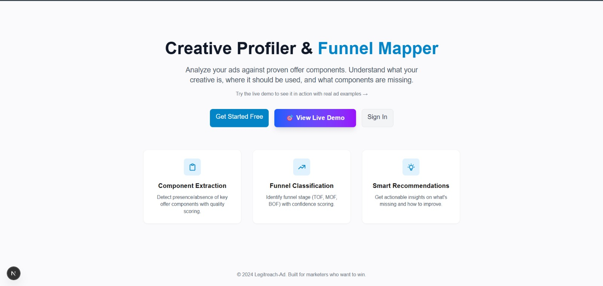
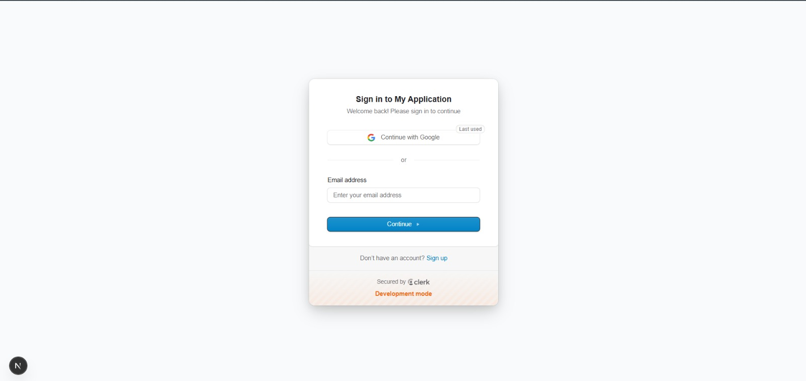
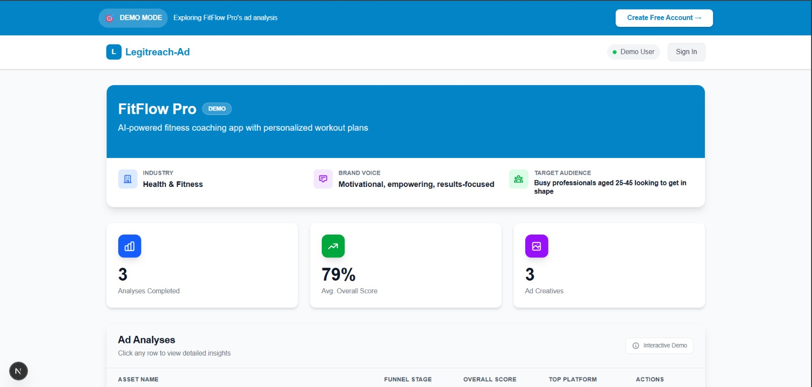
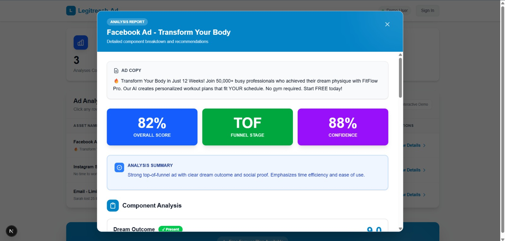
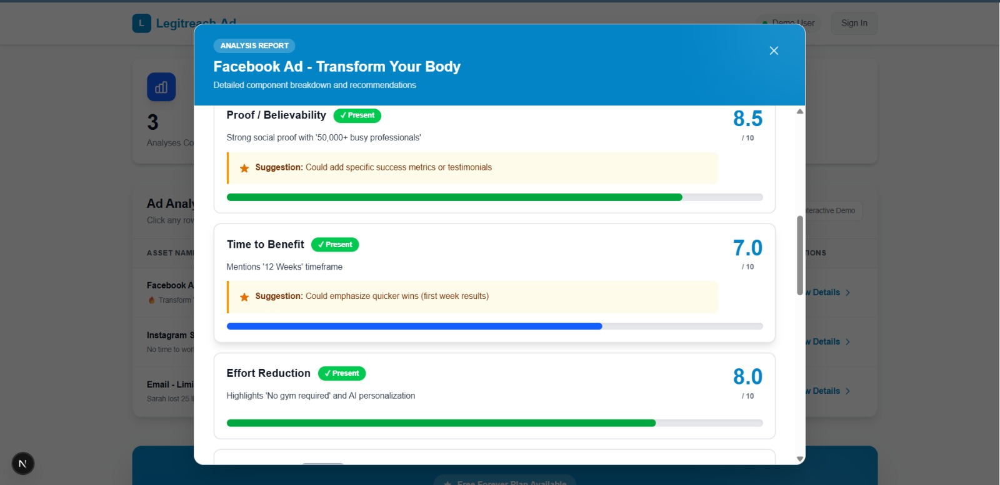
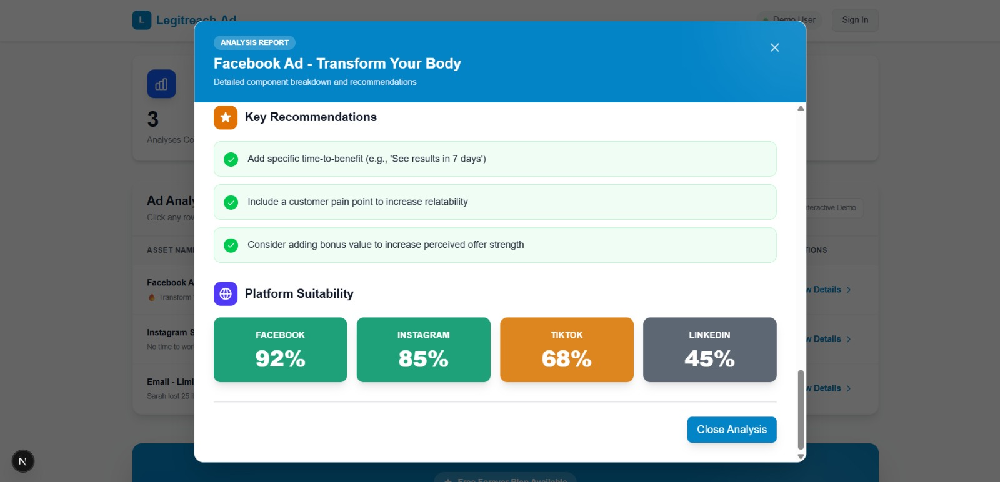

# Legitreach-Ad Research Document

## Title

Stage-Aware Creative Profiling for Ad Analysis: Combining Eugene Schwartz Awareness Theory, Offer Component Modeling, and Structured AI Evaluation

## Abstract

This document presents a complete research-style description of the Legitreach-Ad project, grounded in three internal theory references: an awareness and sophistication framework, a 14-component irresistible offer framework, and a stage-placement CRF concept. The system goal is practical: help marketers understand what a creative is doing, which funnel stage it belongs to, which persuasion components are present or missing, and what to improve next.

The core argument of this work is that ad quality is not only about writing quality. It is also about structure, stage fit, and component placement. In simple terms, a good message in the wrong place still underperforms. The current product already implements component scoring and funnel mapping (COMP1-COMP10), and this research document extends that logic to a broader stage-aware framework where Conditional Random Fields (CRF) can outperform purely prompt-based large language model (LLM) analysis in consistency, speed, and placement diagnosis.

## Keywords

Creative profiling, funnel mapping, Eugene Schwartz, awareness stage, sophistication, component scoring, hidden Markov model, conditional random field, large language model, ad diagnostics, stage alignment

---

## 1. Introduction

Modern ad teams face the same repeated problem: creatives are produced quickly, but diagnosis is slow and subjective. Teams often ask:

- Is this a top-funnel or bottom-funnel ad?
- Are we proving enough, or only promising?
- Is the structure complete, or are key persuasion blocks missing?
- Is the message in the right order for the buyer mindset?

Legitreach-Ad addresses this through AI-supported creative profiling. The current platform already provides:

- Component extraction and scoring
- Funnel stage classification (TOF/MOF/BOF)
- Confidence and recommendation outputs
- Platform suitability suggestions

This document combines theory and implementation into one research narrative and proposes a next-step model direction: stage-aware structured prediction (CRF) on top of component logic.

---

## 2. Problem Statement

Most ad evaluation workflows today have three limitations:

1. They check copy quality but ignore psychological stage alignment.
2. They detect persuasive elements but do not enforce component sequencing logic.
3. They depend on human review or open-ended prompts, which can vary between runs.

As noted in the stage-aware structured prediction notes, many ads fail not because writing is poor, but because components are placed in the wrong stage of persuasion flow.

Research need:
Build a system that can detect components, score component strength, and evaluate whether placement/order matches the audience's awareness and decision stage.

---

## 3. What Is a Creative Profiler? (Simple Explanation)

A creative profiler is a structured ad evaluator.

In simple words, it reads ad text (and later multimodal creative signals), then answers:

- What persuasion ingredients are present?
- How strong is each ingredient?
- Which funnel stage does this ad target?
- What is missing?
- What should be changed first?

So instead of generic feedback like "make it better," it gives diagnostic feedback like:

- Dream outcome is clear, but proof is weak.
- Time-to-benefit exists but early wins are unclear.
- Funnel stage appears TOF, but CTA language is too BOF.

This turns copy review from opinion-based to framework-based.

---

## 4. Theoretical Foundation

### 4.1 Eugene Schwartz Awareness and Sophistication

From the awareness and sophistication theory notes:

- Awareness stage asks: how aware is the buyer of problem, solution, and product?
- Sophistication asks: how mature and skeptical is the market?

Practical implication:

- Low awareness audiences need clarity and pain recognition.
- High sophistication audiences need mechanism, proof depth, and differentiation.

A message can be "good" in language but still wrong for the current awareness stage.

### 4.2 Offer Component Framework

From the component framework notes and project docs:

High-performing messaging is built from structured components (entity clarity, pain-to-transformation, mechanism, proof, risk reversal, urgency, CTA architecture, and others). Legitreach-Ad currently operationalizes COMP1-COMP10 in production:

- COMP1 Dream Outcome
- COMP2 Proof / Believability
- COMP3 Time to Benefit
- COMP4 Effort Reduction
- COMP5 Bonus Value
- COMP6 Customer Pains
- COMP7 Customer Desires
- COMP8 Customer Objections
- COMP9 Customer Words
- COMP10 Identity Cues

This gives measurable coverage and gap signals.

### 4.3 Core Joint Insight

Combining both theories:

- Eugene Schwartz explains "who the message is for right now".
- Component framework explains "what must be present and how strongly".

Together, they define both stage fit and structural completeness.

---

## 5. Why LLM Can Do This, and Why CRF Can Be Better for Some Parts

### 5.1 How LLM Helps

LLMs are strong at:

- Understanding varied ad language
- Summarizing what is conveyed
- Generating human-readable recommendations
- Handling noisy, messy, real-world copy

That is why current Legitreach-Ad analysis nodes can produce meaningful narrative insights and improvement suggestions.

### 5.2 Why CRF Can Be Better for Stage-Aware Structure

From the stage-aware structured prediction notes, CRF has structural advantages for this specific task:

- Deterministic outputs for repeated inputs
- Explicit sequence modeling (label transitions)
- Fast inference for large ad batches
- Better enforcement of component placement logic

Simple interpretation:

- LLM is excellent for understanding language.
- CRF is excellent for enforcing sequence logic and consistency.

So a hybrid architecture is natural:

- LLM for semantic understanding and explanation
- CRF for stage-placement validation and structured diagnostics

---

## 6. Literature Survey: HMM vs CRF vs LLM for Creative Profiling

### 6.1 Hidden Markov Models (HMM)

HMMs model sequential states and transitions with strong independence assumptions.

Strengths:

- Clear probabilistic state transitions
- Historically important for sequence labeling
- Conceptually useful baseline for stage progression

Limitations for this task:

- Emission assumptions are restrictive for rich ad language
- Hard to represent many overlapping lexical and semantic features
- Less flexible with modern embedding-based features

Conclusion:
HMM is useful as a conceptual predecessor but limited for high-dimensional persuasion diagnostics.

### 6.2 Conditional Random Fields (CRF)

CRFs model conditional sequence probabilities and can use rich contextual features.

Strengths:

- Captures dependencies between neighboring component labels
- Supports structured BIO tagging for component spans
- Uses handcrafted plus embedding-derived features
- Deterministic and efficient at inference time

Why relevant here:
Component placement is exactly a sequence problem. CRF can learn whether transitions (for example from pain to mechanism to proof) are coherent with high-performing patterns.

### 6.3 LLM-Based Approaches

Prompted LLM methods (zero-shot/few-shot/chain-of-thought) are powerful for flexible interpretation.

Strengths:

- Strong semantic understanding
- Minimal upfront labeling to start
- Excellent natural-language feedback quality

Limitations in strict diagnostics:

- Output variance across runs
- Weak explicit transition modeling unless heavily constrained
- Slower and more expensive for large-scale repeated auditing

### 6.4 Comparative Summary

For stage-aware creative profiling:

- HMM: good foundational sequence idea, weaker feature flexibility.
- CRF: strongest fit for deterministic sequence diagnostics and placement scoring.
- LLM: strongest fit for language understanding and recommendation generation.

Best practical direction:
A hybrid LLM + CRF stack, where CRF acts as structural auditor and LLM acts as semantic interpreter and advisor.

---

## 7. Project Implementation Context (Legitreach-Ad)

### 7.1 System Summary

Legitreach-Ad is a FastAPI + LangGraph backend with Next.js frontend.
Current workflow:

1. Prepare context from brand inputs + ad content
2. Evaluate components (COMP1-COMP10)
3. Classify funnel stage (TOF/MOF/BOF)
4. Recommend platform suitability
5. Assemble final report with summary and action points

### 7.2 Why This Matters for Research

The product is already a functional prototype of theory-driven ad diagnostics.
It operationalizes component and stage thinking in a deployable user flow, making it a suitable base for formal research expansion into sequence-aware structured models.

---

## 8. Screenshot-Based Interface and Component Placement Evidence

This section uses demo screenshots to show how the product communicates component presence, scoring, and placement context to users.

### 8.1 Landing Page: Problem Framing and Feature Decomposition

Observed design logic:

- Hero message clearly states the product purpose (creative profiling and funnel mapping).
- Three feature cards map to research variables:
  - Component Extraction
  - Funnel Classification
  - Smart Recommendations

This mirrors the analytical pipeline: detect, classify, then improve.

### 8.2 Authentication Layer and Usability Gate

Observed design logic:

- Sign-in is simple and low-friction.
- Entry point quality matters because iterative diagnostics require repeated usage.

While not a persuasion theory component directly, this step affects real-world adoption and feedback-loop speed.

### 8.3 Dashboard: Structured Snapshot of Performance State

Observed signals:

- Aggregate metrics are visible at top (analyses completed, average score, creatives).
- Brand context (industry, tone, target audience) is displayed upfront.

Research relevance:
Brand context visibility supports component interpretation consistency because scoring depends on audience and voice assumptions.

### 8.4 Analysis Report (Header and Funnel Signals)

Observed signals:

- Ad copy block displayed before scores (good interpretability ordering).
- Three key indicators grouped together:
  - Overall score
  - Funnel stage
  - Confidence

This creates an immediate stage-aware reading before entering detailed component diagnostics.

### 8.5 Component Presence and Strength Cards

Observed signals:

- Per-component status uses explicit presence badges.
- Numeric score per component is shown.
- Suggestion blocks are attached locally to weak or improvable components.

This is a concrete implementation of component completeness and local gap diagnosis.

### 8.6 Recommendation and Platform Mapping Layer

Observed signals:

- Recommendations are phrased as specific actions (time-to-benefit, pain point, bonus value).
- Platform suitability scores map diagnostic outcomes to deployment choices.

This demonstrates a practical bridge from analysis to media execution.

---

## 9. Proposed Research Model

### 9.1 Hypothesis

Stage-aware component placement accuracy predicts practical ad quality better than component presence alone.

### 9.2 Model Strategy

Phase 1 (current baseline):
LLM-driven component + funnel diagnostics (already in product).

Phase 2 (research extension):
CRF-based structured placement model with outputs:

- Component span detection (BIO labels)
- Per-component strength score
- Stage alignment score
- Transition/placement violation list
- Reordering recommendations

Phase 3 (hybrid):
CRF provides deterministic structural diagnosis; LLM generates human-readable explanation and rewrite guidance.

---

## 10. Experimental Design (Suggested)

### 10.1 Data

- 400-800 labeled ads across categories
- Annotation includes:
  - component presence/spans
  - strength scores
  - stage placement quality

### 10.2 Baselines

- HMM sequence baseline
- Prompted LLM baseline (zero-shot/few-shot)
- CRF model
- Hybrid CRF + LLM model

### 10.3 Metrics

- Component detection F1
- Strength score MAE
- Placement diagnosis accuracy
- Inference time per ad
- Inter-rater agreement vs expert labels
- Downstream proxy: expert-rated revision quality lift

### 10.4 Practical Outcome Metrics

- Reduction in diagnosis time
- Increase in quality of revision decisions
- Improvement in consistency across repeated audits

---

## 11. Contributions of This Work

This integrated document contributes four things:

1. A unified theory map combining Eugene Schwartz awareness/sophistication and component-based messaging structure.
2. A clear positioning of HMM, CRF, and LLM for stage-aware ad diagnostics.
3. A project-grounded explanation using actual Legitreach-Ad architecture and screenshots.
4. A practical research roadmap from current LLM pipeline to hybrid structured diagnostics.

---

## 12. Limitations

- Current deployed component set is COMP1-COMP10 (not full framework coverage yet).
- Screenshot evidence is from demo mode and should be supplemented with production traffic studies.
- Direct conversion-lift causality requires controlled experiments beyond interface-level diagnostics.

---

## 13. Conclusion

Legitreach-Ad already demonstrates that creative profiling can be systematic, explainable, and operational. The next major step is moving from component presence scoring to stage-aware structural diagnostics. The theoretical combination is clear:

- Eugene Schwartz theory explains audience readiness and messaging depth requirements.
- Component framework explains what persuasive blocks should exist.
- CRF can enforce structural order and placement consistency.
- LLM can interpret language and produce actionable explanations.

Therefore, the most robust path forward is not CRF versus LLM, but CRF plus LLM, where each model handles the part of the problem it is best suited for.

---

## References (Project-Internal Sources)

- Internal awareness, sophistication, and cognitive-cue notes
- Internal 14-component irresistible offer framework notes
- Internal stage-aware CRF concept and structured diagnosis notes
- Project docs: README.md, DOCUMENTATION.md, backend/README.md
- Demo screenshots: home_page.jpeg, sign_up.jpeg, dashboard.jpeg, ad_analysis.jpeg, ad_analysis_2.jpeg, ad_analysis_3.jpeg
